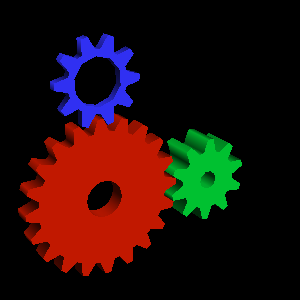

# sdlgpu_gears

A faithful recreation of the original `glxgears` program (found in [mesa-demos](https://fossies.org/linux/mesa-demos/src/xdemos/glxgears.c)) using the SDL3 [SDL_gpu](https://wiki.libsdl.org/SDL3/CategoryGPU) API.

Only Vulkan (Linux) and Direct3D12 (Linux or Windows) are supported, because I don't have a Mac to test Metal with.
